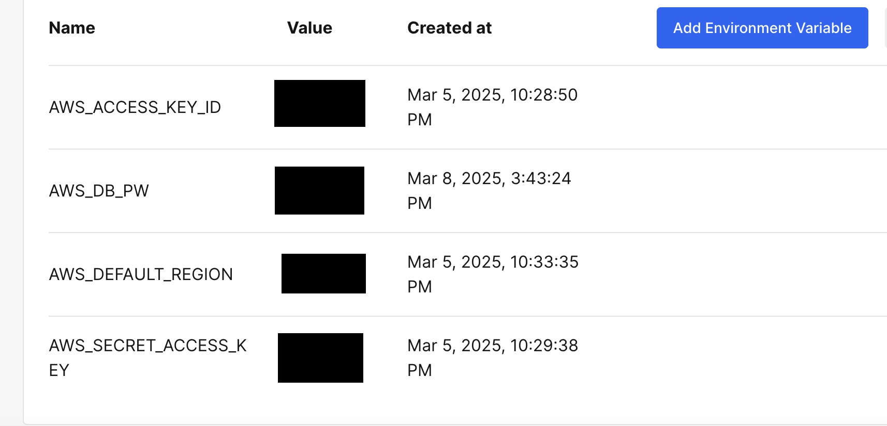
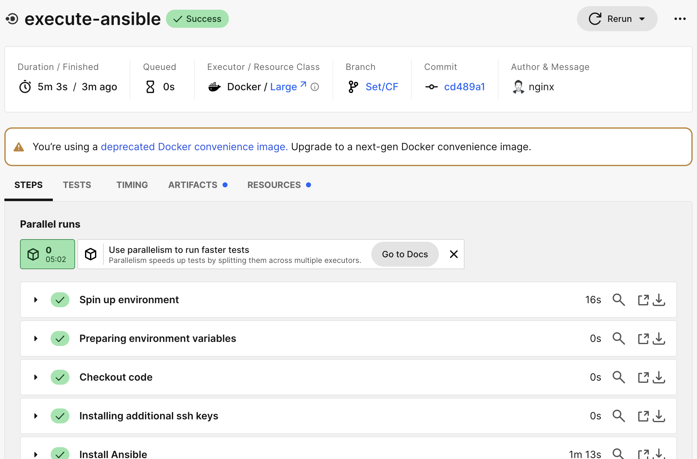

mageimages# 第一工程で行ったこと（1_SetCF.md）

## 概要
CloudFormation、CircleCI、Ansible、Serverspecを使ってクラウドイ>ンフラ環境の自動構築。
・GitHubのPushがトリガーになり、CircleCIのWorkflowが実行
・1JobとしてCloudFormation
・2JobとしてAnsible(CloudFormationがトリガー)
・3JobとしてServerspec（Ansibleがトリガ）

## 1.CircleCIの環境変数とSSH Keyを設定
CircleCI上で、環境変数「AWS_ACCESS_KEY_ID」「AWS_DB_PW」「AWS_DEFAULT_REGION」「AWS_SECRET_ACCESS_KEY」を設定した。
  

CircleCI上で「SSH Key」を設定した。
  

template（CircleCIの設定ファイル）
 - [**config.yml**](/template1/circleci/config.yml)  

## 2. Cloudformationの各テンプレート実行
  

template
- [**vpc.yml**](/template1/cloudformation/vpc.yml)  
- [**security.yml**](/template1/cloudformation/security.yml) 
- [**resources.yml**](/template1/cloudformation/resources.yml)  

## 3. Ansibleのアプリ等のセットアップ設定
Railsアプリケーションのインストールに必要な設定を実行。
Rails(7.1.3.2)
Ruby(3.2.3)
yarn(1.22.19)
node(17.9.1)
bundler(2.3.14)
その他
  
 

Template(Ansibleの設定ファイル)
 - [**inventory.yml**](/template1/ansible/inventory.yml)  
 - [**playbook.yml**](/template1/ansible/playbook.yml)  
 - [**main.yml(swap)**](/template1/ansible/roles/swap/tasks/main.yml)  
 - [**main.yml(git)**](/template1/ansible/roles/git/tasks/main.yml)  
 - [**main.yml(app-in)**](/template1/ansible/roles/app-in/tasks/main.yml)  
 - [**main.yml(yum)**](/template1/ansible/roles/yum/tasks/main.yml) 
 - [**main.yml(mysql)**](/template1/ansible/roles/mysql/tasks/main.yml)
 - [**main.yml(ruby)**](/template1/ansible/roles/ruby/tasks/main.yml)
 - [**main.yml(rails)**](/template1/ansible/roles/rails/tasks/main.yml)
 - [**main.yml(bundler)**](/template1/ansible/roles/bundler/main.yml)
 - [**main.yml(node)**](/template1/ansible/roles/node/main.yml)
 - [**main.yml(yarn)**](/template1/ansible/roles/yarn/tasks/main.yml)
 - [**main.yml(imagemagick)**](/template1/ansible/roles/imagemagick/tasks/main.yml)
 - [**main.yml(nginx)**](/template1/ansible/roles/nginx/tasks/main.yml)
 - [**main.yml(setup)**](/template1/ansible/roles/setup/tasks/main.yml)

## 4. Serverspecのテスト
git,nginxのインストール確認
  

template
 - [**Gemfile**](/template1/serverspec/Gemfile)  
 - [**sample_spec.rb**](/template1/serverspec/spec/54.64.64.240/sample_spec.rb)

## 5. アプリの実行結果
自動デプロイした Webアプリケーションに、ブラウザーから接続。画像を保存して動作状況を確認した。
  

 
## 6. 考察
サーバー組み込みの環境で、Webアプリケーションのデプロイを完成。今後、サーバーを組み替えていく予定。
