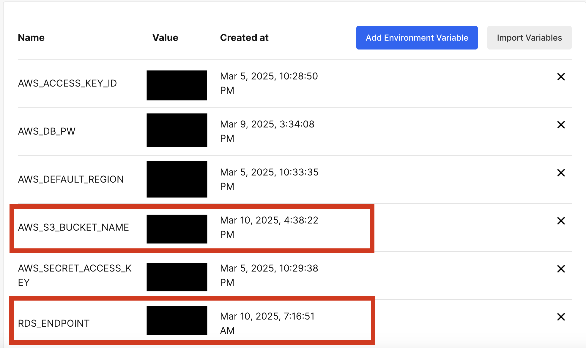

# 第2工程で行ったこと（2_SetCF2.md）

## 概要
第1工程（1_SetCF.md）で、サーバー組み込み環境で、Webアプリケーションのデプロイを完成している。  
本工程では、以下のとおり進めた
- puma、nginx、RDS(MySQL)を使って3層構造にサーバーを組み替え
- アプリのユーザーはALB経由でEC2にアクセス
- 画像の保管場所をEC2からS3に指定
- CloudWatchとSNSもCloudformationで自動構築し、ALBターゲットグループにUnHealthyHostがああった場合、メールでアラート通知
  

## 1.CircleCIの環境変数追加状況
- CircleCI上で、Ansible用に環境変数に前回から「RDS_ENDPOINT」、「AWS_S3_BUCKET_NAME」を追加設定した。
  
   
 

template
- [**config.yml（ホストのIPアドレスの変更のみ）**](/template2/circleci/config.yml)  

## 2. Cloudformationの各テンプレート実行
- resources.ymlでALBリスナーデフォルト数値の微修正
- 新規にcloudwatch_sns.ymlを作成し、ALBターゲットグループにUnHealthyHostがある場合、メール通知されるように自動設定した。
  
  

template
- [**vpc.yml（前回から変更なし）**](/template2/cloudformation/vpc.yml)  
- [**security.yml（前回から変更なし）**](/template2/cloudformation/security.yml) 
- [**resources.yml（前回から変更あり）**](/template2/cloudformation/resources.yml)  
- [**cloudwatch_sns.yml（前回から追加）**](/template2/cloudformation/cloudwatch_sns.yml)

## 3. Ansibleのアプリ等のセットアップ設定
Railsアプリケーションのインストールに必要な設定を実行。
- roles（ruby）はrbenvからrvmを使ったインストールに切り替え
- roles（ruby,setup,setup_server）でpuma,nginx,socket接続等で大きく追加
　→ development.rb（setupのtemplates）でAWSからアプリへの接続許可等  
  → database.yml（setupのtemplates）でRDSへの接続  
  → storage.yml（setupのtemplates）で画像保存をS3に設定  
  → puma.rb他（setup_serverのtemplates）でpumaのソケット設定等  
　→ nginx.conf（setup_serverのtemplates）でnginxの設定  
- その他rolesは微修正
  
 

Template(Ansibleの設定ファイル、全て前回から変更あり)
 - [**inventory.yml**](/template2/ansible/inventory)  
 - [**playbook.yml**](/template2/ansible/playbook.yml)  
 - [**main.yml(swap)**](/template2/ansible/roles/swap/tasks/main.yml)  
 - [**main.yml(git)**](/template2/ansible/roles/git/tasks/main.yml)  
 - [**main.yml(app-in)**](/template2/ansible/roles/app-in/tasks/main.yml)  
 - [**main.yml(yum)**](/template2/ansible/roles/yum/tasks/main.yml) 
 - [**main.yml(mysql)**](/template2/ansible/roles/mysql/tasks/main.yml)
 - [**main.yml(ruby)**](/template2/ansible/roles/ruby/tasks/main.yml)
 - [**main.yml(rails)**](/template2/ansible/roles/rails/tasks/main.yml)
 - [**main.yml(bundler)**](/template2/ansible/roles/bundler/tasks/main.yml)
 - [**main.yml(node)**](/template2/ansible/roles/node/tasks/main.yml)
 - [**main.yml(yarn)**](/template2/ansible/roles/yarn/tasks/main.yml)
 - [**main.yml(imagemagick)**](/template2/ansible/roles/imagemagick/tasks/main.yml)
 - [**main.yml(nginx)**](/template2/ansible/roles/nginx/tasks/main.yml)
 - [**main.yml(setup)**](/template2/ansible/roles/setup/tasks/main.yml)
 - [**main.yml(setup_server)**](/template2/ansible/roles/setup_server/tasks/main.yml)

## 4. Serverspecのテスト
git,nginxのインストール確認（前回と変更なし）
  

template（前回と変更なし）
 - [**Gemfile**](/template2/serverspec/Gemfile)  
 - [**sample_spec.rb**](/template2/serverspec/sample_spec.rb)

## 5. アプリの実行状況確認
1. 自動デプロイした Webアプリケーションに、ALBのDNS名を使ってブラウザーから接続。画像を保存してS3に追加、削除されるまでを確認した。  
- Webアプリケーションのトップページを表示    
  
  
- アプリに画像を追加させて表示

- S3に画像が保存された状況  

- S3の画像を表示した状況  

- アプリで画像を削除した状況

 
- S3の画像も削除が反映された状況

2. アラームの通知がEmail宛に送られることを確認した。
-VPCからネットワークの様子を確認

- ALBターゲットグループからネットワークが正常な状況を確認

- ALBターゲットグループから、ネットワークに異常を発生させた状況を確認

- SNS Topicで設定した通知用メールアドレスに通利が来る様子を確認

- SNS Topicで設定した通知用メールアドレスに通利が来る様子を確認

## 6. 考察
puma、nginx、RDS(MySQL)の3層構造に、RailsのWebアプリケーションをデプロイし、さらにS3での画像保管と、ALBでの分散をCloudFormationで反映させた。  
その後、CloudWatchとSNSのTopicを使ってアラーム通知を自動設定に追加した。
今後、Terraformの活用、Fargate導入を課題とする。
