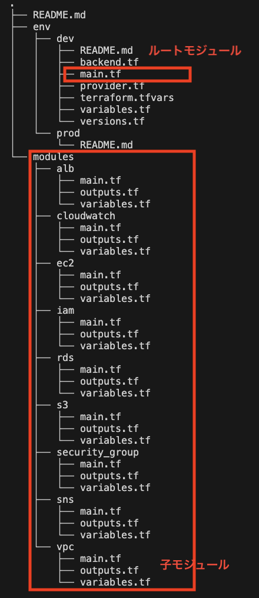
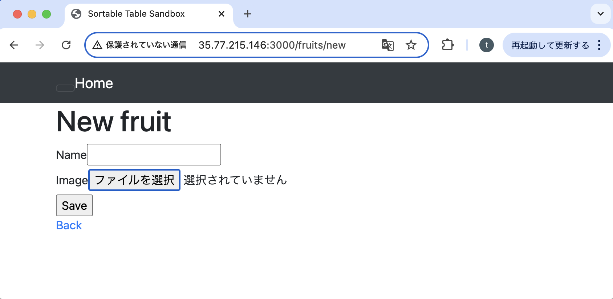

# 第3工程で行ったこと（3_SetTF.md）
Terraformを活用し、AWSのクラウドインフラ環境を自動構築した。puma、nginx、RDS(MySQL)の3層構造に、RailsのWebアプリケーションをデプロイし、同アプリに投稿した画像のS3保管、ALBでの分散、CloudFormationのアラーム通知までを自動構築させた。

## 概要
第2工程（2_SetCF.md）で、本工程で行いたいことをCloudFormationで実現した。今回はCloudFormationを使わず、Terraformのモジュールを活用して、同クラウドインフラ環境を自動構築した。

本工程では、cloudformationでのリソース環境をTerraformで再現することとした。
- Terraformのコード作成とAWSとの連携設定
- CircleCI、Ansible、Serverspecと連携した自動構築環境を作成
（アプリのデプロイも含む）
  

  
   
 
  

## 1. Terraformの各モジュール作成
- ルートモジュールをenv/devに作成。開発環境と本番環境でルートモジュールを分けることができ、ルートモジュールから、子モジュールを呼び出せるよう、下図のディレクトリ構成とした。
  
  

template
- [**vpc.yml（前回から変更なし）**](/template2/cloudformation/vpc.yml)  
- [**security.yml（前回から変更なし）**](/template2/cloudformation/security.yml) 
- [**resources.yml（前回から変更あり）**](/template2/cloudformation/resources.yml)  
- [**cloudwatch_sns.yml（前回から追加）**](/template2/cloudformation/cloudwatch_sns.yml)
- [**vpc.yml（前回から変更なし）**](/template2/cloudformation/vpc.yml)
- [**security.yml（前回から変更なし）**](/template2/cloudformation/security.yml)
- [**resources.yml（前回から変更あり）**](/template2/cloudformation/resources.yml)
- [**cloudwatch_sns.yml（前回から追加）**](/template2/cloudformation/cloudwatch_sns.yml)
- [**vpc.yml（前回から変更なし）**](/template2/cloudformation/vpc.yml)
- [**security.yml（前回から変更なし）**](/template2/cloudformation/security.yml)
- [**resources.yml（前回から変更あり）**](/template2/cloudformation/resources.yml)
- [**cloudwatch_sns.yml（前回から追加）**](/template2/cloudformation/cloudwatch_sns.yml)

## 2. Circleciの環境設定と、実行      
- Terraformのモジュールで実行できるよう、前回から「」を環境設定に加えた。
- CircleCIのconfig.ymlをTerraformの自動実行ができるように記述し、実行した。

template
- [**config.yml（terraformの自動実行jobを追加）**](/template3/circleci/config.yml)

## 3. Ansibleのアプリ等のセットアップ設定
Railsアプリケーションのインストールに必要なツールのインストールと、サーバーテンプレートの設定変更を実行。（前回と変更なし）
  
 

Template(Ansibleの設定ファイル）
 - [**inventory.yml**](/template3/ansible/inventory)  
 - [**playbook.yml**](/template3/ansible/playbook.yml)  
 - [**main.yml(swap)**](/template3/ansible/roles/swap/tasks/main.yml)  
 - [**main.yml(git)**](/template3/ansible/roles/git/tasks/main.yml)  
 - [**main.yml(app-in)**](/template3/ansible/roles/app-in/tasks/main.yml)  
 - [**main.yml(yum)**](/template3/ansible/roles/yum/tasks/main.yml) 
 - [**main.yml(mysql)**](/template3/ansible/roles/mysql/tasks/main.yml)
 - [**main.yml(ruby)**](/template3/ansible/roles/ruby/tasks/main.yml)
 - [**main.yml(rails)**](/template3/ansible/roles/rails/tasks/main.yml)
 - [**main.yml(bundler)**](/template3/ansible/roles/bundler/tasks/main.yml)
 - [**main.yml(node)**](/template3/ansible/roles/node/tasks/main.yml)
 - [**main.yml(yarn)**](/template3/ansible/roles/yarn/tasks/main.yml)
 - [**main.yml(imagemagick)**](/template3/ansible/roles/imagemagick/tasks/main.yml)
 - [**main.yml(nginx)**](/template3/ansible/roles/nginx/tasks/main.yml)
 - [**main.yml(setup)**](/template3/ansible/roles/setup/tasks/main.yml)
 - [**main.yml(setup_server)**](/template3/ansible/roles/setup_server/tasks/main.yml)

## 4. Serverspecのテスト
git,nginxのインストール確認（前回と変更なし）
  

template（前回と変更なし）
 - [**Gemfile**](/template2/serverspec/Gemfile)  
 - [**sample_spec.rb**](/template2/serverspec/sample_spec.rb)

## 5. アプリの実行状況確認
1. 自動デプロイした Webアプリケーションに、ALBのDNS名を使ってブラウザーから接続。画像を保存してS3に追加、削除されるまでを確認した。  
- Webアプリケーションのトップページを表示    
  
  
- アプリに画像を追加させて表示

- S3に画像が保存された状況  

- S3の画像を表示した状況  

- アプリで画像を削除した状況

 
- S3の画像も削除が反映された状況

2. アラームの通知がEmail宛に送られることを確認した。
-VPCからネットワークの様子を確認

- ALBターゲットグループからネットワークが正常な状況を確認

- ALBターゲットグループから、ネットワークに異常を発生させた状況を確認

- SNS Topicで設定した通知用メールアドレスに通利が来る様子を確認

- SNS Topicで設定した通知用メールアドレスに通利が来る様子を確認

## 6. 考察
puma、nginx、RDS(MySQL)の3層構造に、RailsのWebアプリケーションをデプロイし、さらにS3での画像保管と、ALBでの分散、CloudWatchとSNSのTopicを使ったアラーム通知を、Terraform
を活用して環境構築した。
今後、Fargate導入を課題とする。
