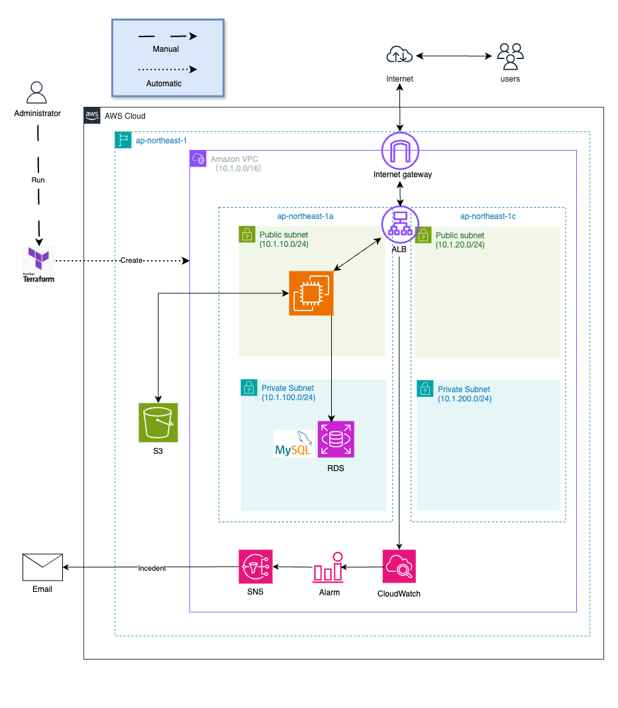

# Terraform成果物の概要
- Terraformを活用し、AWSのクラウドインフラ環境を自動構築する
- VPC、EC2、RDS、ALBで、サーバー３層構造、分散環境に対応
- S3で、CRUDアプリの画像保管が可能
- CloudWatchとSNSで、EC2とALB間の通信異常を検知、アラーム通知が可能

## AWSクラウドインフラ環境がわかる構成図
  

## 開発環境について
- 開発環境(terraform/env/dev)と本番環境（terraform/env/prod）に環境を分けた
- terraform/modules内の子モジュールは、環境env内のルートモジュールmain.tfから呼び出す。
- AWS接続に必要な環境変数は、別ファイルで設定

## ディレクトリの作業環境の構成がわかる図
  

